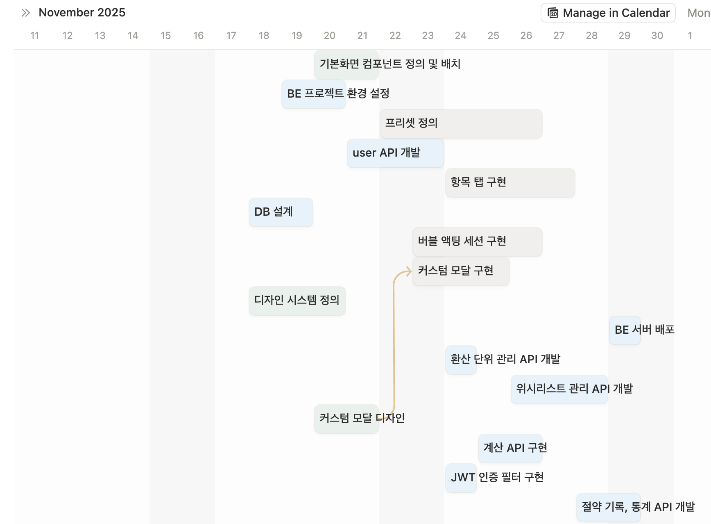

# PM & Design Risk Management

**가치 계산기 프로젝트**의 기획(PM) 및 디자인(DE) 파트에서  
발생한 주요 리스크와 그에 대한 판단, 대응 과정을 정리한 문서

---

### 1. 초기 문제 정의 불명확 리스크

- **리스크 범주**
    - 기획 / 전략

- **문제 상황**
    - 초기 기획 단계에서 구현하고 싶은 화면과 인터랙션은 비교적 빠르게 떠올랐으나,  
      해당 화면이 **어떤 사용자 문제를 해결하는지에 대한 정의가 명확하지 않은 상태**

- **배경**
    - 아이디어 중심으로 화면과 기능을 먼저 구상함  
    - 문제 정의보다 해결책 설계가 선행된 상태였음

- **대응 및 해결**
    - 팀원들과의 아이디어 회의를 통해 실제 소비 상황에서의 불편 요소를 재정의함  
    - 소비 금액이 숫자로만 인식되어 체감되지 않는다는 문제로 수렴함  
    - 문제 정의 이후 서비스 방향과 핵심 기능을 재정렬함

- **결과 및 한계**
    - 서비스의 핵심 가치와 방향성이 명확해짐  
    - 초기 단계에서 문제 정의에 더 많은 시간을 투자했다면 기획 안정성을 더 확보할 수 있었을 것으로 판단됨

### 2. 디자인 시스템 선행 정의 부족 리스크

- **리스크 범주**
    - 디자인 / 일정

- **문제 상황**
    - 팀원별로 확보 가능한 시간이 상이하고 전체 일정이 넉넉하지 않은 상황에서,  
      디자인 작업을 비교적 빠르게 마쳐야 하는 제약이 존재

- **제약 조건**
    - 팀원별 작업 가능 시간 차이  
    - 결과물을 빠르게 공유해야 하는 일정 구조  
    - 화면 구현을 우선시할 수밖에 없는 일정적 판단

- **대응 및 해결**
    - 컴포넌트 정의를 충분히 선행하지 않은 상태에서 화면 디자인을 먼저 진행함  
    - 이후 반복적으로 사용되는 UI 요소를 기준으로 시각적 일관성을 유지하도록 조정함  
    - Notion을 활용해 팀원별 작업 일정과 완료 시점을 시각화하여 실시간으로 공유함
    

- **결과 및 한계**
    - 사용자 관점에서의 화면 일관성은 유지할 수 있었음  
    - 컴포넌트 구조를 초기 단계에서 정리하지 못해 디자인 수정 및 작업 시간이 증가함  
    - 일정 관리 측면에서는 초반에 협업 리스크를 효과적으로 줄일 수 있었음

### 3. 컴포넌트 세분화 기준 설정 리스크

- **리스크 범주**
    - 디자인 / 시스템 설계

- **문제 상황**
    - 디자인 시스템을 구성하는 과정에서 컴포넌트를 어느 수준까지 세분화해야 할지에 대한 기준이 명확하지 않았음

- **판단 배경**
    - 디자인 시스템 구축 경험 부족  
    - 재사용성을 높이기 위한 세분화와 관리 복잡도를 줄이기 위한 묶음 사이의 균형 필요

- **대응 및 해결**
    - input, header, title, icon, card, modal 등 기능과 역할이 유사한 요소를 기준으로 컴포넌트를 그룹화함  
    - 과도한 원자 단위 분리보다는 실제 화면에서 반복 사용되는 단위를 중심으로 설계함

- **결과 및 한계**
    - 기본적인 재사용성과 화면 일관성은 확보할 수 있었음  
    - 초기 단계에서 세분화 기준을 명확히 정의했다면 이후 확장 시 판단 비용을 줄일 수 있었을 것으로 판단됨

### 4. 기획 문서 활용도 저하 리스크

- **리스크 범주**
    - 커뮤니케이션 / 협업

- **문제 상황**
    - 개발이 본격적으로 진행되면서 텍스트 기반 기획 문서의 참조 빈도가 점차 낮아짐

- **환경적 요인**
    - 개발자는 기획 문서보다 디자인 화면을 기준으로 구현하는 경우가 많았음

- **대응 및 해결**
    - 기능 정의 및 상태 설명을 Figma 화면에 직접 기재함  
    - 디자인 파일을 실질적인 개발 기준 문서로 활용함

- **결과 및 한계**
    - 개발자와의 커뮤니케이션 효율이 향상됨  
    - 기획 문서는 배경 설명용으로, 디자인 문서는 개발 기준 문서로 역할이 명확해짐

### 5. 사용자 체류 유도 전략에 대한 설계 판단 리스크

- **리스크 범주**
    - UX / 디자인 전략

- **문제 상황**
    - 본 서비스는 단순 계산 도구가 아닌, 소비 금액을 ‘체감하는 경험’을 제공하는 것이 목표였기 때문에 사용자가 화면에 얼마나 머무를지에 대한 UX 설계가 중요한 요소

- **판단 배경**
    - 과도한 시각적 자극은 다음 서비스 환경 내에서 이질감을 유발할 수 있음  
    - 반대로 자극이 부족할 경우 사용자가 계산 결과만 확인하고 즉시 이탈할 가능성 존재  
    - 사용자 체류 시간에 대한 명확한 정량적 기준이 없는 상태에서 디자인 결정을 내려야 했음

- **대응 및 해결**
    - 수박게임 형태의 물리 기반 애니메이션을 핵심 경험으로 설정하여 자연스러운 체류를 유도  
    - 색상, 모션, 인터랙션의 강도를 기존 다음 서비스 톤에 맞춰 제한적으로 설계
    - 과도한 보상 요소나 게임적 장치는 의도적으로 배제

- **결과 및 한계**
    - 사용자에게 부담을 주지 않는 선에서 경험 중심의 체류 유도를 구현할 수 있었음  
    - 다만 실제 체류 시간에 대한 정량적 검증은 진행하지 못한 한계가 존재

### 6. 다음 모듈 연동을 전제로 한 디자인 제약 리스크

- **리스크 범주**
    - 플랫폼 / 환경

- **문제 상황**
    - 본 서비스는 단독 서비스가 아닌, **다음 웹 홈 하위 모듈로 확장될 가능성**을 전제로 디자인됨

- **설계 전제**
    - 기존 다음 서비스 UI 환경과의 조화를 고려해야 하는 플랫폼적 맥락 존재  
    - 과도한 개성 표현 시 이질감이 발생할 수 있다고 판단함

- **대응 및 해결**
    - 다음 서비스의 컬러 톤과 유사한 색상 사용  
    - 과도한 브랜드 색상 사용을 지양함  
    - 기존 모듈 구조를 참고한 레이아웃 설계

- **결과 및 한계**
    - 전체 서비스 환경과의 이질감을 최소화함  
    - 독립 서비스로 확장될 경우 브랜드 정체성 강화가 필요하다는 한계 존재
